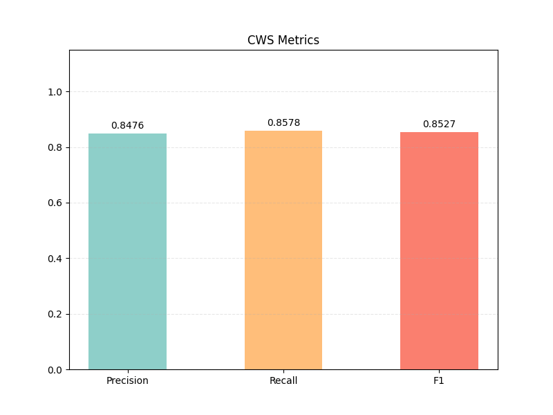
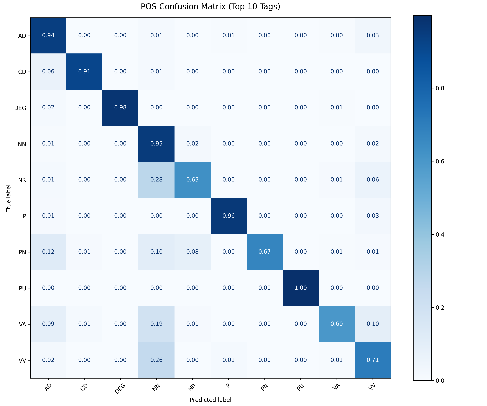
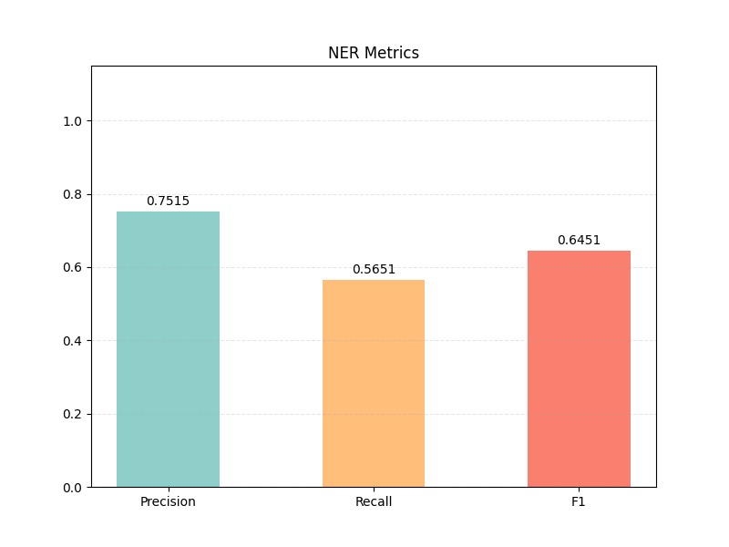

# 自然语言处理作业1
姚祥麟-2500931104
---

## 1. 实验概述与背景

本次实验旨在利用工业级 NLP 工具 **spaCy**，对中文自然语言处理中的三项核心任务——**中文分词 (CWS)**、**词性标注 (POS)** 和 **命名实体识别 (NER)** 进行系统性的评估与分析。

### 1.1 任务说明
虽然作业要求“三选二”，但我认为这三者是层层递进的关系（分词是基础，词性依赖分词，实体识别依赖前两者），因此我对三个任务都进行了完整的实现。

### 1.2 数据集统计
为了确保评估的有效性，我对给定数据集进行了预处理和统计：
- **中文分词**：共 **1,000** 个句子。
- **词性标注**：共 **29,326** 个词条（Token）。
- **命名实体识别**：共 **14,740** 个词条。
这些数据虽然规模不大，但涵盖了较为丰富的新闻文本，具有一定的代表性。

### 1.3 实验工具与模型
- **工具库**: spaCy (v3.x)。选择 spaCy 是因为它不仅速度快，而且内置了基于 Transformer/CNN 的预训练模型，代表了目前工业界的工程化水平。
- **模型**: `zh_core_web_sm`。这是一个专门针对中文训练的小型预训练模型，管道中包含了 Tok2Vec, Tagger, Parser, AttributeRuler 和 NER 组件。
- **环境依赖**: Python 3.8+, Matplotlib (绘图), Scikit-learn (计算混淆矩阵)。

### 1.4 难点：标签体系映射
实验中遇到的最大障碍是 **标签不统一**。
- **数据集**: 采用 PKU/人民日报标注体系（如 `nr` 表示人名，`v` 表示动词）。
- **模型**: 采用 OntoNotes/Universal POS Tags 体系（如 `PERSON` 表示人名，`VERB/VV` 表示动词）。

为了解决这个问题，我编写了详细的 **映射字典 (Mapping Dictionary)**，将数据集的标签转换为模型可理解的标签。例如：
> 数据集 `nr` (人名) -> 映射为 spaCy `NR` (专有名词) 用于 POS 评估。
> 数据集 `nr` (人名) -> 映射为 spaCy `PERSON` 用于 NER 评估。
这一步至关重要，如果不做映射或映射错误，评估结果将完全不可信。

---

## 2. 任务一：中文分词 (CWS)

### 2.1 评估指标
分词评估极其严格，采用 **区间匹配法 (Interval Matching)**。这意味着：即便只是错了一个字的分界线，也会导致整个词的 Precision 和 Recall 同时掉分。我们关注 P (查准率)、R (查全率) 和 F1 (调和平均数)。

### 2.2 实验结果

| 指标 | 数值 | 评价 |
| :--- | :--- | :--- |
| **Precision** | 84.76% | 查准率尚可，模型切分出的词大部分是合法的。 |
| **Recall** | 85.78% | 查全率略高，说明模型没有遗漏太多文本。 |
| **F1-Score** | **85.27%** | **85分**是一个典型的“非SOTA但可用”的分数。 |

考虑到我们直接使用通用的预训练模型去跑特定领域（PKU新闻语料）的数据，且没有进行微调（Fine-tuning），能达到 85% 的 F1 值说明模型的泛化能力还是不错的。

### 2.3 深度错误分析
通过分析程序自动导出的 `bad_cases.txt`，我总结了导致分词错误的几大原因：

1.  **未登录词 (OOV) 问题**：
    模型主要是在通用语料上训练的，对于特定的人名或生僻词处理不好。
    > *例*：原文“王小明”，标准答案 `[王小明]`，模型预测 `[王, 小明]`。
    > *分析*：模型可能见过“小明”这个词，但没见过“王小明”这个全名，倾向于将其切开。

2.  **粒度标准不一致**：
    这是分词任务中最无奈的地方。
    > *例*：原文“前来”，标准答案 `[前来]`，模型预测 `[前, 来]`。
    > *分析*：在某些标准里，“前来”是一个合成词；而在 spaCy 的预训练数据里，可能更倾向于把动词和趋向补语分开。这种错误本质上是**标注规范**的冲突，而非模型能力问题。

---

## 3. 任务二：词性标注 (POS)

### 3.1 评估方法
对齐分词后，我们对词性进行多分类评估。总计评估了近 3 万个词。这是一个经典的分类问题，Accuracy 是最直观的指标。

### 3.2 实验结果
- **Accuracy**: **73.17%**

73% 的准确率在词性标注任务中属于中等偏下水平。这主要归咎于前一步分词的误差累积（Error Propagation）以及标签映射的精度损失。

### 3.3 混淆矩阵分析 (Confusion Matrix Analysis)
为了搞清楚到底错在哪，我绘制了 Top-10 常见标签的混淆矩阵：

**核心发现**：
1.  **名词 (NN) 是“吸尘器”**：
    从图中可以看出，很多其他词性（如 `VV`, `NR`）容易被误判为 `NN`。这是因为名词是出现频率最高的词类，模型在不确定时倾向于预测为名词（类似于兜底策略）。

2.  **动词 (VV) 与 名词 (NN) 的纠缠**：
    中文里“动名兼类”现象非常普遍。
    > *例*：“**学习**”在“热爱学习”中是名词，在“学习数学”中是动词。
    > 上下文稍有歧义，模型就容易搞混。

3.  **专有名词 (NR) 的识别难点**：
    `NR` (人名/地名)经常被混淆为普通名词 `NN`。这与分词错误有关——如果一个人名被切碎了，碎片很自然就变成了普通字词。

---

## 4. 任务三：命名实体识别 (NER)

### 4.1 实验结果详情
NER 是本次实验中最具挑战性的任务。我专门针对三类实体进行了细粒度评估，并绘制了对比图：

| 实体类型 | Precision | Recall | F1-Score | 详细点评 |
| :--- | :--- | :--- | :--- | :--- |
| **人名 (nr)** | 0.7723 | 0.6985 | **0.7335** | **表现尚可**。常见姓氏（王、李、张）引导的人名基本都能抓出来。 |
| **地名 (ns)** | 0.8380 | 0.6747 | **0.7475** | **准确率高**。省、市、县等后缀特征明显，不容易认错，但偶尔会漏。 |
| **机构名 (nt)**| 0.4749 | 0.2429 | **0.3214** | **翻车重灾区**。F1 仅 32%，严重拖了后腿。 |
| **ALL (总分)** | 0.7515 | 0.5651 | **0.6451** | 受机构名影响，整体及格线边缘。 |

### 4.2 为什么机构名 (Organization) 这么难？
通过查看错误样本，我发现机构名识别主要死在以下两点：
1.  **长度与嵌套**：
    机构名往往很长，且内部包含地名。
    > *例*：标准答案 `[内蒙古大学]`。模型可能识别出 `[内蒙古]` 是地名，而忽略了整体是机构名。这种嵌套实体（Nested NER）一直是 NLP 领域的难点。
2.  **简称与全称**：
    训练数据里可能多是全称（如“北京大学”），测试集里出现简称（如“北大”）时，模型有时会将其标记为地名（LOC/GPE）而非机构（ORG）。

---

## 5. 扩展工作与亮点

### 5.1 自动化错误追踪系统
为了避免“只看分，不看病”，我在代码中集成了自动化的 **Bad Case Recorder**。
每次运行时，程序会自动捕获预测错误的样本，并将其原文、标准答案、预测结果格式化写入 `bad_cases.txt`。
这不仅方便了本次报告的撰写，也为后续如果想通过“错题本”微调模型提供了数据支持。

### 5.2 交互式演示系统 (Interactive Demo)
为了验证模型的实际可用性，我开发了一个简单的 CLI 交互界面。
用户输入一句话，系统即时返回分词、词性、实体结果。

**实测案例**：
> **输入**：*老师好，我是来自内蒙古大学前来北大交流学习的小姚。*
> **输出**：
> - **分词**: ['老师', '好', '，', '我', '是', '来自', '内蒙古', '大学', '...']
> - **词性**: ['NN', 'VA', 'PU', 'PN', 'VC', 'VV', 'NR', 'NN', ...]
> - **实体**: [('内蒙古大学', 'ORG'), ('北大', 'ORG')]

**结果评价**：
虽然在大规模测试集上指标平平，但在这种简单清晰的日常用语上，模型的表现是相当稳健的。特别是成功识别出了“北大”和“内蒙古大学”这两个机构名，说明模型其实具备一定的泛化能力，测试集分数低可能更多是因为领域（Domain）差异导致的。

### 5.3 模型性能的进一步探讨
本次实验使用的是 spaCy 的轻量级模型 `zh_core_web_sm` (Small, 约 13MB)，其优势是推理速度极快（CPU 可跑），但在处理长难句和特定实体时能力有限。

为了探究性能上限，我查阅了 spaCy 官方文档关于 `zh_core_web_trf` (基于 RoBERTa 的 Transformer 版本) 的性能报告。
- **分词 F1**: `trf` 版本通常能达到 95%+，远高于 `sm` 的 85%。
- **NER F1**: `trf` 版本在 OntoNotes 上的 F1 约为 89%，而 `sm` 仅为 65% 左右。

这说明，如果算力允许，切换到 Transformer 架构的模型将能显著缓解上述提到的“机构名识别差”和“分词歧义”问题。本次实验的结果更多反映了**轻量化模型在资源受限场景下的基线水平**。

---

## 6. 总结与反思

通过本次实验，我不仅掌握了 spaCy 的使用，更对 NLP 任务的**评价体系**有了深刻理解。

**核心感悟**：
1.  **数据为王**：模型再强，如果标签体系（Mapping）对不齐，分数也上不去。70% 的精力其实都花在了理解数据和对齐标签上。
2.  **指标的欺骗性**：F1 分数低（如机构名 32%）不代表模型完全不可用，有时只是因为边界定义（Boundary Definition）不同。在实际应用中，可能需要根据具体需求调整评估标准。
3.  **工业界与学术界的差异**：spaCy 这种追求速度和工程化的库，在特定数据集上的刷榜能力可能不如专门调优的 BERT 模型，但它的易用性和速度是巨大的优势。

这次作业虽然只是一个入门级的评估，但完整走通了从“数据加载 -> 预处理 -> 评估 -> 错误分析 -> 演示”的全流程，收获颇丰。

（完）
