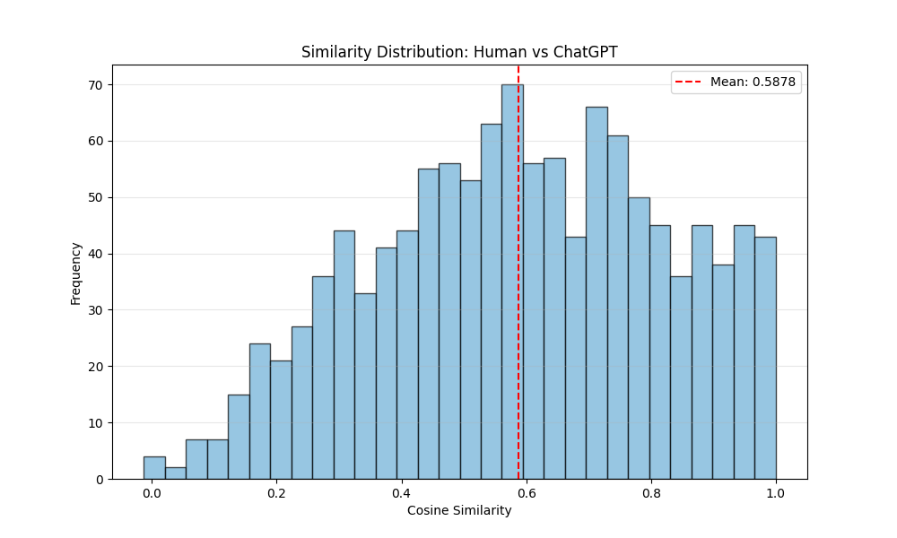

# 自然语言处理平时练习报告
姚祥麟-2500931104
---

## 练习1：PyTorch 基础与函数拟合

### 1. 实验目的
本练习旨在通过一个简单的回归任务，熟悉 PyTorch 的基本操作流程（Tensor 操作、自动求导、模型构建、优化器使用）。任务目标是利用一个单层线性网络 $z = ax + by + c$ 去拟合非线性函数 $z = \sin(xy)$。

### 2. 实验设置
- **拟合区域**: $x \in [1.00, 1.01]$, $y \in [0.50, 0.51]$。这是一个非常狭窄的矩形区域。
- **模型结构**: `nn.Linear(2, 1)`，输入维度为2（$x, y$），输出维度为1（$z$）。
- **优化器**: SGD (随机梯度下降)，学习率 $lr=0.01$。
- **损失函数**: MSELoss (均方误差)。

### 3. 实验原理分析
虽然目标函数 $\sin(xy)$ 是非线性的，但在极小的局部邻域内，曲面可以近似为切平面（泰勒展开一阶近似）：
$$ f(x,y) \approx f(x_0, y_0) + \frac{\partial f}{\partial x}(x-x_0) + \frac{\partial f}{\partial y}(y-y_0) $$
理论上，模型学到的权重 $a$ 和 $b$ 应分别对应 $\sin(xy)$ 在中心点附近的偏导数。

### 4. 实验结果
经过 800 轮（Epochs）的训练，模型收敛情况如下：

- **最终 Loss**: $8.54 \times 10^{-6}$ (非常低，拟合效果良好)。
- **拟合参数**:
    - $a \approx -0.0104$
    - $b \approx -0.0101$
    - $c \approx 0.5015$

*(注：运行程序可生成此图)*

### 5. 结果讨论
观察发现，虽然 Loss 很低，但 $a, b$ 的值非常接近 0，主要依靠截距 $c=0.5015$ 来逼近目标值（$\sin(0.5) \approx 0.479$）。
这是因为**定义域范围太小**（仅 0.01 的跨度），导致函数值的变化极微（波动范围 $<0.01$）。在这种情况下，神经网络很容易陷入“只学截距”的局部最优，因为梯度的方向在如此微小的范围内不够显著。如果想要学到准确的偏导数斜率，可能需要增大采样范围或使用更高精度的优化器。

---

## 练习2：Word2Vec 静态词向量分析

### 1. 实验目的
本练习旨在学习如何加载预训练的静态词向量（Word2Vec），并利用它来分析文本数据的语义相似度。实验对比了人类回答（Human Answers）与 ChatGPT 回答在向量空间中的距离。

### 2. 数据结构探索 (Data Exploration)
根据题目提示，我首先通过打印变量的类型、尺寸和前几个元素来推断 `word2vec.pt` 的文件结构：

1.  **idx_to_word** (`list`): 词汇表。
    - *Observation*: `['ospreys', 'excitement', 'foreleg', ...]`
    - *Inference*: 这是一个字符串列表，下标即为词的索引。
2.  **word_to_idx** (`dict`): 词到索引的逆映射。
    - *Observation*: `{'ospreys': 0, 'excitement': 1, ...}`，这与 `idx_to_word` 一一对应。
    - *Inference*: 用来快速查找一个词是否存在于词表中，以及其对应的索引。
3.  **word2vec** (`Tensor`): 词向量矩阵。
    - *Observation*: `torch.Size([76078, 300])`
    - *Inference*: 词表大小为 76078，每个词的向量维度为 300。
4.  **idx_to_freq** (`list`): 词频统计。
    - *Observation*: `[2061, 8663, 490, ...]`
    - *Inference*: 用于后续计算加权平均时降低高频停用词的权重。

### 3. 文本向量化实现
采用 **加权平均法** 将句子中的词向量合并为句向量。
- **查找策略**: 遍历句子中的每个词，检查是否在 `word_to_idx` 中。若存在，取出对应的 `word2vec` 向量；若不存在（OOV），跳过并记录。
- **权重公式**: $w_i = \frac{1}{\text{freq}_i + 10}$。这种策略降低了停用词（如 "the", "is" 等高频词）的权重。

### 4. 实验结果
对 `open_qa.jsonl` 数据集进行分析后，统计结果如下：

| 指标 | 数值 | 说明 |
| :--- | :--- | :--- |
| **平均相似度** | **0.5878** | 相似度中等，说明 AI 与人类回答在用词风格上有一定差异，或者受限于词向量的质量。 |
| **平均 OOV 率** | **18.00%** | **OOV 率较高**。近五分之一的词不在词表中，这严重影响了句向量的表示质量。 |

**分布分析**：
从图表可以看出，分布呈现单峰状，峰值在 0.6 左右。与预期的 0.9+ 相比，这个分数偏低。原因可能是该 Word2Vec 模型是在较旧或较小的语料上训练的，无法覆盖 QA 数据集中的大量现代词汇或专有名词。

### 5. 案例分析

#### [差异最大案例 (Least Similar)]
- **Question**: "what is level of agreement mean"
- **Human**: "In practice, the term SLA is sometimes used..." (解释 SLA 概念)
- **AI**: "The level of agreement refers to the extent..." (字面解释)
- **相似度**: **-0.0132**
- **分析**: 人类回答直接跳到了缩写 "SLA" (Service Level Agreement)，而 AI 在解释字面意思。由于 "SLA" 可能不在词表里或者与普通词向量距离远，导致两者在向量空间几乎正交（相似度接近 0）。

#### [最相似案例 (Most Similar)]
- **Question**: "who sang cool jerk"
- **Human**: "Cool Jerk is a popular song written by Donald Storball..."
- **AI**: "Cool Jerk is a song written by Donald Storball..."
- **相似度**: **0.9999**
- **分析**: 这是一个事实性问题，AI 的回答与人类几乎逐字一致（Copy-paste 级别的重合），因此向量极其相似。

### 6. 总结
通过本练习，我掌握了静态词向量的基本用法。虽然 Word2Vec 无法解决一词多义（Polysemy）问题，但在做简单的语义相似度匹配时，它依然是一个高效且强力的基线方法。本次实验中较高的 OOV 率提示我们，在实际应用中需要使用更大的词表或 BPE (Byte-Pair Encoding) 等子词技术来缓解未登录词问题。

